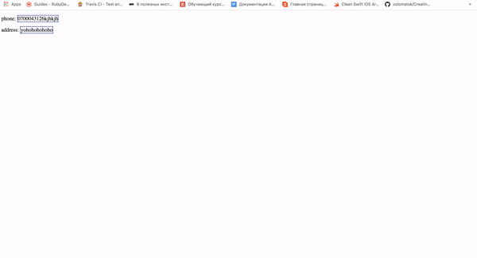

# djazz
Djazz is helper library for Django framework

## Installation
1. via pip: `pip install git+https://github.com/akoikelov/djazz`
or
2. download repository: https://github.com/akoikelov/djazz and run script `./install.sh`

## Configuration

Add `akoikelov.djazz` to INSTALLED_APPS in settings.py:
```python
INSTALLED_APPS = [
    'tastypie',
    'akoikelov.djazz'
]
```

### Code generators

There are several commands inside:
- `python manage.py gen_model [app_name] [model_name]`
- `python manage.py gen_admin [app_name]`

### Backup tool

For backup of database and media files, there is a command:

- `python manage.py backup [-s] [-m] [-r]`
- `python manage.py backup [-l]`

* -s: option for saving backup
* -l: option for loading latest backup
* -m: also backup media files
* -r: Delete old backups and replace them with a new backup

We store backups at Dropbox.
Add `DROPBOX_ACCESS_TOKEN` param to settings.py, containing dropbox access token

### Static Info constructor

Configuration:

1. Add `url(r'^', include('akoikelov.djazz.urls'))` to urls.py
```python
    urlpatterns = patterns(
        url(r'^', include('akoikelov.djazz.urls')), # djazz urls
        url(r'^admin/', include(admin.site.urls)),
)
```
2. Add `akoikelov.djazz.context_processors.sic` to context_processors
```python
    TEMPLATES = [
        {
            'BACKEND': 'django.template.backends.django.DjangoTemplates',
            'DIRS': [os.path.join(BASE_DIR, 'templates')]
            ,
            'OPTIONS': {
                'context_processors': [
                    ...,
                    'akoikelov.djazz.context_processors.sic' # context processor
                ]
            },
        },
]
```

In template:

- Load `djazz` at the top of your template
- Use `` tag at the end of your template (it should be placed after jquery library script tag)
- If you don't have jquery, set `SIC_INCLUDE_JQUERY = True` in settings.py
- Every element with static content should have `sic` attribute with the key value
- Inside element just use `sic_get` template tag with a key value provided
- In order to be able to edit data, please make sure you are logged in as an administrator
- To edit an information of the element, just click on it and an modal window will be popped up

```djangotemplate


phone: 
<span sic="phone">
    
</span>

<script src="jquery_link"></script>
{% include_si ^}
```

There are `SIC_SAVE_BTN_LABEL`, `SIC_TEXTAREA_PLACEHOLDER` attributes which can be set in settings.py

